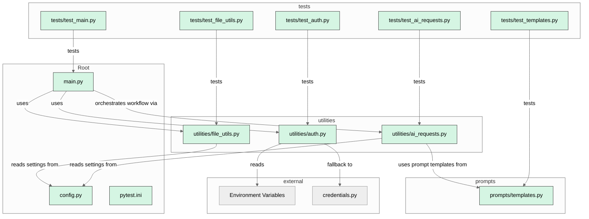

# Code2Chart - Automated MermaidJS Diagram Generator via OpenAI

[](LICENSE)

Code2Chart is a tool that leverages AI to analyze your codebase and generate [MermaidJS](https://mermaid-js.github.io/) diagrams automatically. It is designed to help developers visualize project structure, dependencies, and relationships with minimal manual effort. Never let your module diagrams grow stale again!

## Features

- **Automated Codebase Analysis:** Uses AI to summarize and infer relationships between files.
- **MermaidJS Output:** Generates ready-to-use Mermaid diagrams for documentation.
- **CLI Tool:** Simple command-line interface for easy integration into workflows.
- **Append or Overwrite:** Choose to append diagrams to existing markdown files or create new ones.
- **Customizable:** Easily extend or adapt for different project structures.

## Getting Started

1. **Clone the repository:**

```bash
git clone https://github.com/yourusername/code2chart.git
cd code2chart
```

2. **Install dependencies:**

```bash
pip install -r requirements.txt
```

3. **Set up your API key:**

- Ensure you have an OpenAI API key set in your environment variables.

4. **Run the generator:**

```bash
python main.py <input_directory> --output README.md
```

- Use `--append` if you want to append to an existing file.

## Example

See [`samples/nextjs_mermaid_example.md`](samples/nextjs_mermaid_example.md) for a sample output.

## License

This project is licensed under the MIT License. Do whatever you want with it!

## Acknowledgements

- Inspired by [MermaidJS](https://mermaid-js.github.io/).
- Example SaaS starter code sample from [Vercel's Next.js SaaS Starter](https://github.com/vercel/nextjs-saas-starter) (MIT License).
- Uses [OpenAI](https://platform.openai.com/) for code summarization and relationship inference.

## Contributing

Contributions are welcome! Please open issues or submit pull requests to help improve this project.

---

## MermaidJS Diagram - Generated by [Code2Chart](https://github.com/scmgustafson/code2chart/tree/main)

<!-- END AUTOMATED MERMAID -->
